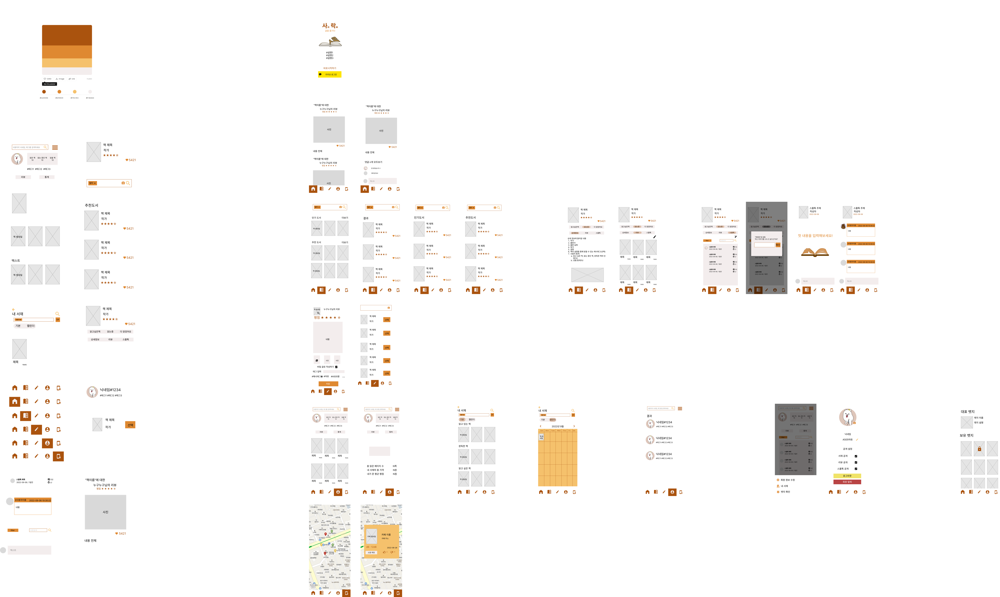

# 사락 (詞樂)

---

> 詞(글 사)
>
> 樂(즐거울 락)
>
> 책을 넘기는 소리, 글을 읽고 쓰고 나누는 즐거움

## 📅프로젝트 진행 기간

---

2022.08.22 - 2022.10.07

## 💡기획 배경

---

대표적인 소셜미디어 인스타그램은 월간 활성 사용자 수(MAU)는 한국 1800만명, 전 세계 20억명으로 전체인구의 1/3이 사용하는 서비스 입니다. 그 중 북스타그램 관련 게시물은 8000만건 이상으로 매우 많이 사용하고 있습니다.

하지만 인스타그램에서는 책의 상세정보를 제공하지 않기 때문에 네이버,알라딘과 같은 책 전용 검색 플랫폼을 따로 사용해야한다는 불편함이 존재합니다.

## 📍서비스 소개

---

'사락' 은 독후감을 통해 사람과 소통하여 자연스럽게 책 내용에 관해 이야기 나눌 수 있고, 독후감을 통해 흥미를 느낀 사람도 책의 정보를 한번에 찾을 수 있는 서비스입니다.

추가로 개인별, 책 별 통계량과 WordCloud를 제공함으로서 더 재미있게 서비스를 즐길 수 있습니다.

## 💻사용 기술

---

### Backend

- 버전

  - IDE : IntelliJ 2022.1.3
  - 언어 : Java 11
  - DataBase : MySQL 8
  - Framework
    - Spring Boot 2.7.3
    - Gradle
    - Application.yml
    - JPA
    - Spring Security 2.7.1

- 설정파일

  

  
build.gradle

  

  

  

  
application.yml

  

  

### Frontend

- 버전

  - IDE : Visual Studio Code 1.71.2
  - Framework
    - Vue 2 LTS
      - router 3.5.1
      - vuetify 2.6.0
      - bootstrap vue 2.22.0
      - babel 7.12.16
      - webpack
  - Nodejs(16.17.0 LTS)

- 설정파일

  

  
.env

  

  

  

  
.env.development

  

  

  

  
package.json

  

  

### CI/CD

- AWS EC2

- Docker 20.10.18

- Docker-compose 1.25.0

- Jenkins 2.361.1

- Nginx 1.18.0

- S3

### DATA

- Hadoop 3.2.1 (Using Provided Common Cluster by SSAFY)

### 협업 환경

- GitLab
- Jira
- MatterMost
- Discord
- Webex
- Notion

## 팀원 소개

---

- 신민아 - Leader, FE, BE, Hadoop, 데이터 수집 + 가공
- 김창현 - FE, Design, 데이터 가공
- 남궁준 - Infra(CI/CD), FE, BE, 데이터 가공
- 양소정 - FE, BE, 데이터 가공
- 이경준 - FE, BE, UCC, 데이터 가공
- 정다은 - FE, BE, Design, 데이터 가공

## 📖프로젝트 산출물

---

### 1. ERD

### 2. Server Architecture

### 3. API 명세서

### 4. WireFrame

### 5. Documents

- [기능명세서](./README/기능_명세.pdf)

- [포팅\_메뉴얼](./README/포팅메뉴얼.pdf)

- [하둡 사용 매뉴얼](./data/Hadoop%20Usage%20Manual.md)

- [최종 발표 자료](./README/%ED%8A%B9%ED%99%94PJT_%EC%84%9C%EC%9A%B8_5%EB%B0%98_A505_%EB%B0%9C%ED%91%9C%EC%9E%90%EB%A3%8C.pptx)

## 💎사락 서비스 화면

---

### 회원가입 및 마이페이지

- 카카오 소셜로그인을 이용하여 회원가입 및 로그인

  

- 마이페이지 화면에서 프로필 사진, 이름 변경, 공개 여부 변경

  

### 책 검색

- 책 검색 – 책 이름, 저자, ISBN, 키워드

  

- 바코드 검색

  

- 독서 트렌드 단어 WordCloud

  

### 리뷰/댓글 작성

- 책 검색을 통해 책 상세 설명 보기

  

- 리뷰를 통해 책 상세 설명 바로 보기

  

- 사진 업로드와 해시태그 기능

  

- 사용자 소통 - 댓글, 좋아요

  

### 개인 통계 데이터 제공

1. 개인통계

   - 책에 대한 통계 표시

   - 많이 읽은 장르 Top3 표시

   - 읽은 책에 대한 통계 표시

   - 리뷰에 많이 쓴 해시태그 WordCloud

     

2. 개인 서재

   - 읽고 있는 책

   - 완독한 책

   - 읽고 싶은 책

     

### 리뷰 모아 보기 / 인기 도서

- 다른 유저의 최신 리뷰 모아보기

  

- 최신 인기 도서

  

### 주변 탐색

- 책을 읽을 장소 탐색

- 평균 측정 소음

- 유저 평가

  

### 사용자 검색

- 사용자 검색 및 타인의 정보 보기

  
